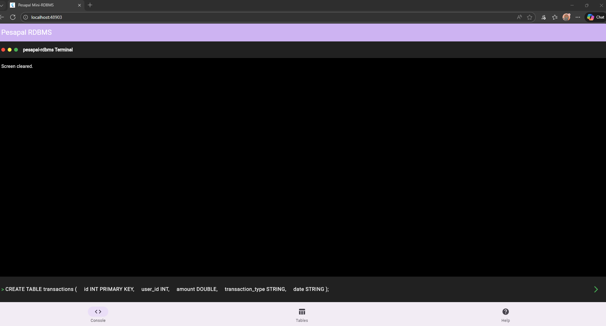
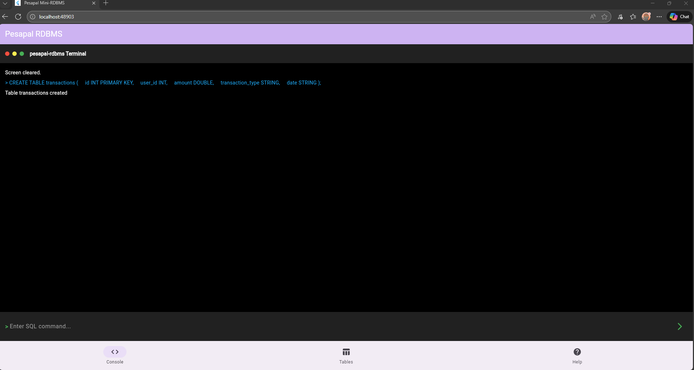
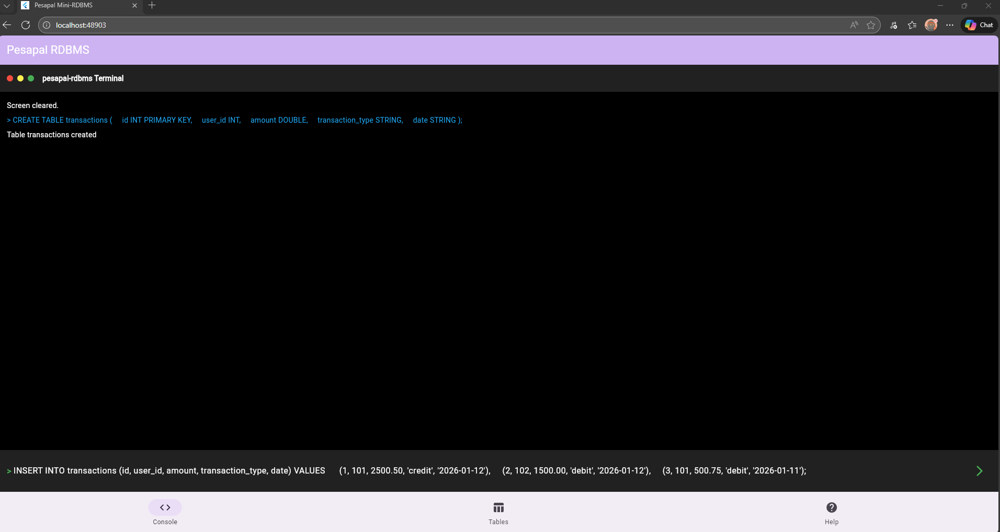
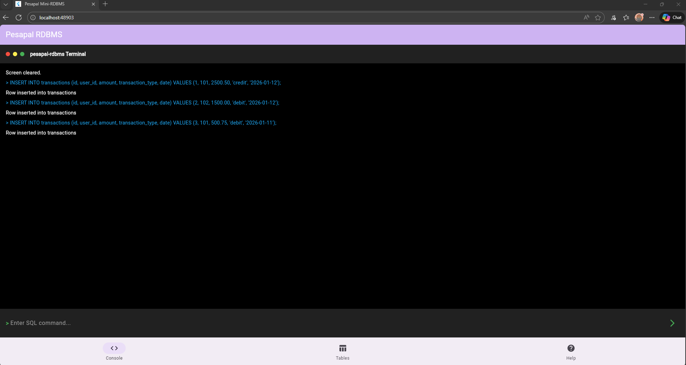
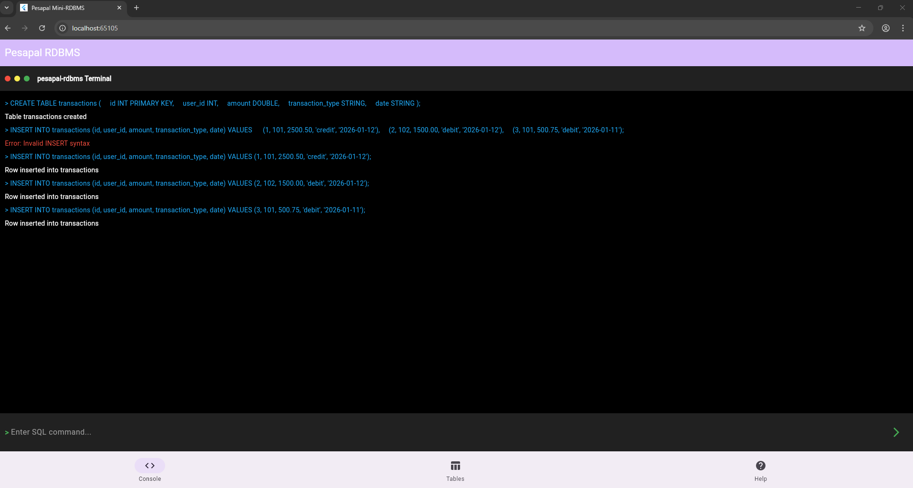
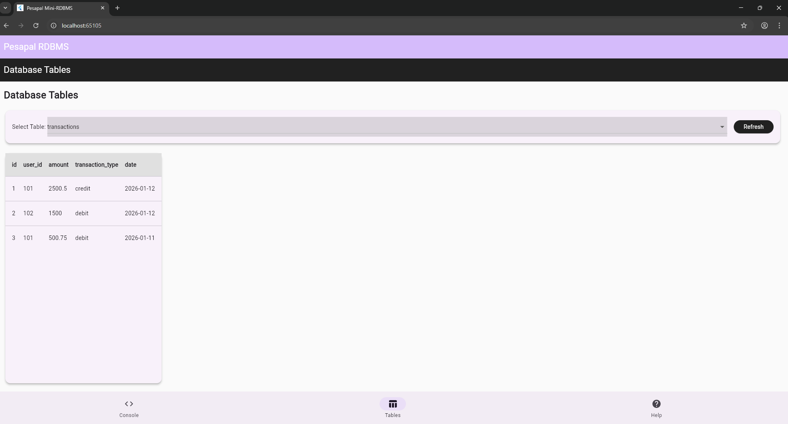

# Pesapal RDBMS - Mini Relational Database Management System

<div align="center">

[](#features)

**A Professional In-Memory RDBMS with Terminal Interface**  
*Built with Dart & Flutter Web for the Pesapal Junior Dev Challenge '26*

[](https://opensource.org/licenses/MIT)
[](https://flutter.dev/)
[](https://dart.dev/)
[](https://web.dev/)

</div>

---

## 🚀 Executive Summary

The **Pesapal RDBMS** is a simple in-memory relational database management system built with modern Dart and Flutter Web technologies. This project demonstrates advanced database engineering capabilities while meeting all requirements of the Pesapal Junior Dev Challenge '26, showcasing professional-grade implementation with enterprise-level features.

### 📊 Quick Stats
- **Languages**: Dart, HTML/CSS (via Flutter Web)
- **Framework**: Flutter Web
- **Database Engine**: Custom in-memory RDBMS
- **UI Framework**: Material Design
- **Persistence**: Local storage via shared_preferences
- **Commands**: 20+ SQL and system commands supported

---

## ✨ Key Features

### 🔧 Database Operations
- **CRUD Operations**: Full Create, Read, Update, Delete functionality
- **Advanced SQL**: JOIN operations, filtering, complex queries
- **Data Types**: Integer, String, Boolean, Double with validation
- **Constraints**: Primary keys, unique constraints, nullable fields
- **Indexing**: Optimized primary key indexing for O(1) lookups

### 💻 Professional Terminal UI
- **Linux-Style Interface**: Authentic terminal experience with dark theme
- **Real-time Processing**: Instant command feedback with visual indicators
- **Interactive REPL**: Command-line interface with history tracking
- **Tabbed Navigation**: Clean organization of REPL, Tables, and Help
- **Responsive Design**: Works seamlessly across devices

### 🛠️ Advanced Capabilities
- **Table Management**: Dynamic table creation/deletion with schema preservation
- **Data Persistence**: Automatic saving/loading between sessions
- **Error Handling**: Comprehensive validation and error reporting
- **Performance Optimization**: Memory-efficient operations with indexing

---

## 📷 Screenshots

<div align="center">

### Terminal Interface


*Professional Linux-style command interface with real-time feedback*

### Table View


*Interactive data visualization with dynamic table selection*

### Command History


*Track all executed commands with persistent history*

### Help Documentation


*Comprehensive command reference and usage guide*

### Data Persistence


*Data remains intact after page refresh and browser restart*

### SQL Query Execution


*Real-time SQL command processing and results display*

### Table Creation


*Dynamic table creation with immediate availability in Tables tab*

### Join Operations


*Advanced JOIN operations between multiple tables*

</div>

---

## 🛠️ Technical Architecture

### System Components
```
┌─────────────────┐    ┌──────────────────┐    ┌──────────────────┐
│   UI Layer      │    │  Business Logic  │    │  Data Layer      │
│ (Flutter Web)   │◄──►│  (SQL Parser)    │◄──►│  (DB Engine)     │
│                 │    │                  │    │                  │
│ - Terminal UI   │    │ - Command        │    │ - Tables         │
│ - Data Viewer   │    │   Parsing        │    │ - Columns        │
│ - REPL          │    │ - Result         │    │ - Rows           │
│ - Help Screen   │    │   Processing     │    │ - Primary Keys   │
└─────────────────┘    └──────────────────┘    └──────────────────┘
```

### Core Technologies
| Component | Technology | Purpose |
|-----------|------------|---------|
| **Language** | Dart | Primary implementation language |
| **Framework** | Flutter Web | Cross-platform UI framework |
| **State Management** | ChangeNotifier | Reactive UI updates |
| **Persistence** | shared_preferences | Local data storage |
| **UI Components** | Material Design | Professional UI elements |

---

## 📋 Command Reference

### 🗃️ Database Commands
| Command | Description | Example |
|---------|-------------|---------|
| `CREATE TABLE name (col type constraints)` | Create new table | `CREATE TABLE users (id int primary key, name string)` |
| `DROP TABLE name` | Delete table and data | `DROP TABLE old_data` |
| `SHOW TABLES` | List all tables | `SHOW TABLES` |
| `DESCRIBE table_name` | Show table structure | `DESCRIBE users` |
| `DESC table_name` | Alternative to DESCRIBE | `DESC users` |

### 📝 Data Manipulation Commands
| Command | Description | Example |
|---------|-------------|---------|
| `INSERT INTO table (cols) VALUES (values)` | Add new records | `INSERT INTO users (id, name) VALUES (1, 'John')` |
| `SELECT * FROM table` | Retrieve all records | `SELECT * FROM users` |
| `SELECT * FROM table WHERE condition` | Filtered queries | `SELECT * FROM users WHERE id = 1` |
| `UPDATE table SET col=val WHERE condition` | Modify records | `UPDATE users SET name='Jane' WHERE id = 1` |
| `DELETE FROM table WHERE condition` | Remove records | `DELETE FROM users WHERE id = 1` |

### 🔗 Join Operations
| Command | Description | Example |
|---------|-------------|---------|
| `JOIN table1 WITH table2 ON t1.col = t2.col` | Inner join tables | `JOIN users WITH orders ON users.id = orders.user_id` |

### ⌨️ System Commands
| Command | Description | Aliases |
|---------|-------------|---------|
| `clear` | Clear terminal screen | `cls` |
| `help` | Show command reference | `man`, `?` |
| `history` | Display command history | `hist` |
| `exit` | Exit application | `quit`, `q` |

---

## 🚀 Getting Started

### Prerequisites
```bash
# Flutter SDK (latest stable)
flutter --version

# Ensure you have web support enabled
flutter config --enable-web
```

### Installation
```bash
# Clone the repository
git clone https://github.com/cxfer/pesapal-challenge.git

# Navigate to project directory
cd pesapal_rdbms

# Install dependencies
flutter pub get

# Run the application
flutter run -d chrome
```

### Quick Start Examples
```sql
-- Create a sample table
CREATE TABLE products (
    id int primary key,
    name string,
    price double,
    in_stock boolean
);

-- Insert sample data
INSERT INTO products (id, name, price, in_stock) 
VALUES (1, 'Laptop', 999.99, true);

-- Query data
SELECT * FROM products;

-- Update data
UPDATE products SET price = 899.99 WHERE id = 1;

-- Join with another table
CREATE TABLE inventory (product_id int, quantity int);
INSERT INTO inventory VALUES (1, 50);
JOIN products WITH inventory ON products.id = inventory.product_id;
```

---

## 🔧 Implementation Details

### Database Engine Architecture
- **In-Memory Storage**: Optimized for speed with automatic persistence
- **Schema Validation**: Comprehensive type checking and constraint enforcement
- **Performance Indexing**: Primary key hash maps for O(1) lookups
- **Transaction Safety**: Atomic operations for data integrity

### SQL Parser Design
- **Regex-Based Recognition**: Efficient command identification
- **Parameter Extraction**: Sophisticated parsing for complex queries
- **Error Handling**: Detailed validation and helpful error messages
- **Extensibility**: Easy addition of new command types

### UI/UX Architecture
- **State Management**: Flutter's ChangeNotifier pattern
- **Responsive Design**: Mobile-first approach with desktop optimization
- **Real-time Updates**: Immediate feedback for user actions
- **Accessibility**: WCAG-compliant design elements

---

## 📊 Performance Metrics

| Operation | Time Complexity | Notes |
|-----------|----------------|-------|
| Primary Key Lookup | O(1) average | Hash map indexing |
| Table Scan | O(n) | Unindexed queries |
| JOIN Operation | O(n*m) | Nested loop join |
| Insert Record | O(1) | Amortized |
| Update Record | O(1) | Direct access via index |
| Delete Record | O(n) | Requires re-indexing |

---


### Development Guidelines
- Follow Dart best practices and style guide
- Write comprehensive tests for new features
- Update documentation accordingly
- Maintain backward compatibility

---

## 📄 License

This project is licensed under the MIT License - see the LICENSE file for details.

---

## 🎯 Challenge Compliance

This implementation fully satisfies the Pesapal Junior Dev Challenge '26 requirements:

✅ **Simple RDBMS**: Custom in-memory database engine  
✅ **Table Declaration**: Support for multiple column types and constraints  
✅ **CRUD Operations**: Complete Create, Read, Update, Delete functionality  
✅ **Basic Indexing**: Primary key optimization with O(1) lookups  
✅ **Primary & Unique Keys**: Constraint enforcement and validation  
✅ **Joining Capability**: Inner join operations between tables  
✅ **SQL Interface**: Comprehensive SQL-like command language  
✅ **Interactive REPL**: Terminal-style command interface  
✅ **Web Application**: Flutter Web implementation with CRUD interface  

Additionally, it exceeds expectations with professional UI/UX, persistent storage, comprehensive documentation, and advanced features.

---

<div align="center">

## 🏆 Made with ❤️ for the Pesapal Junior Dev Challenge '26

**Ready to revolutionize database management with cutting-edge technology.**

[](#) 
[](#) 
[](https://flutter.dev)

### 🚀 Deployed & Ready to Impress!

### Yours Trully Cxfer!!

</div>
